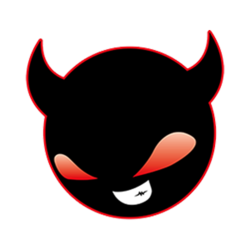
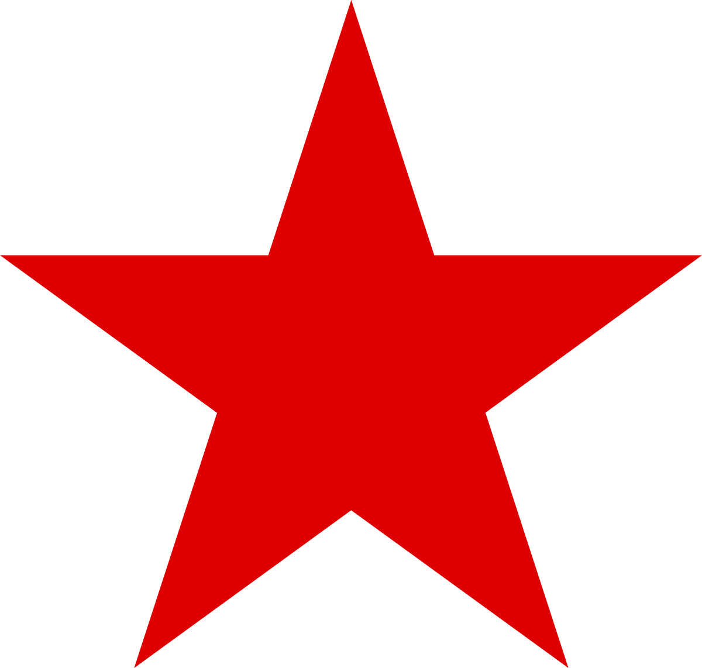
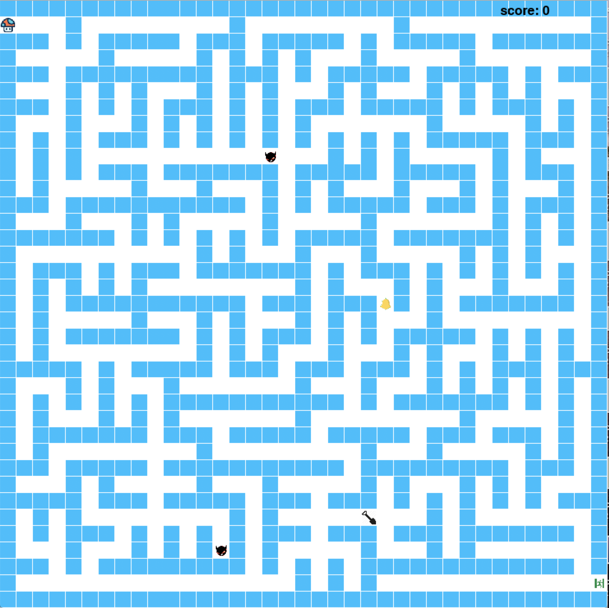
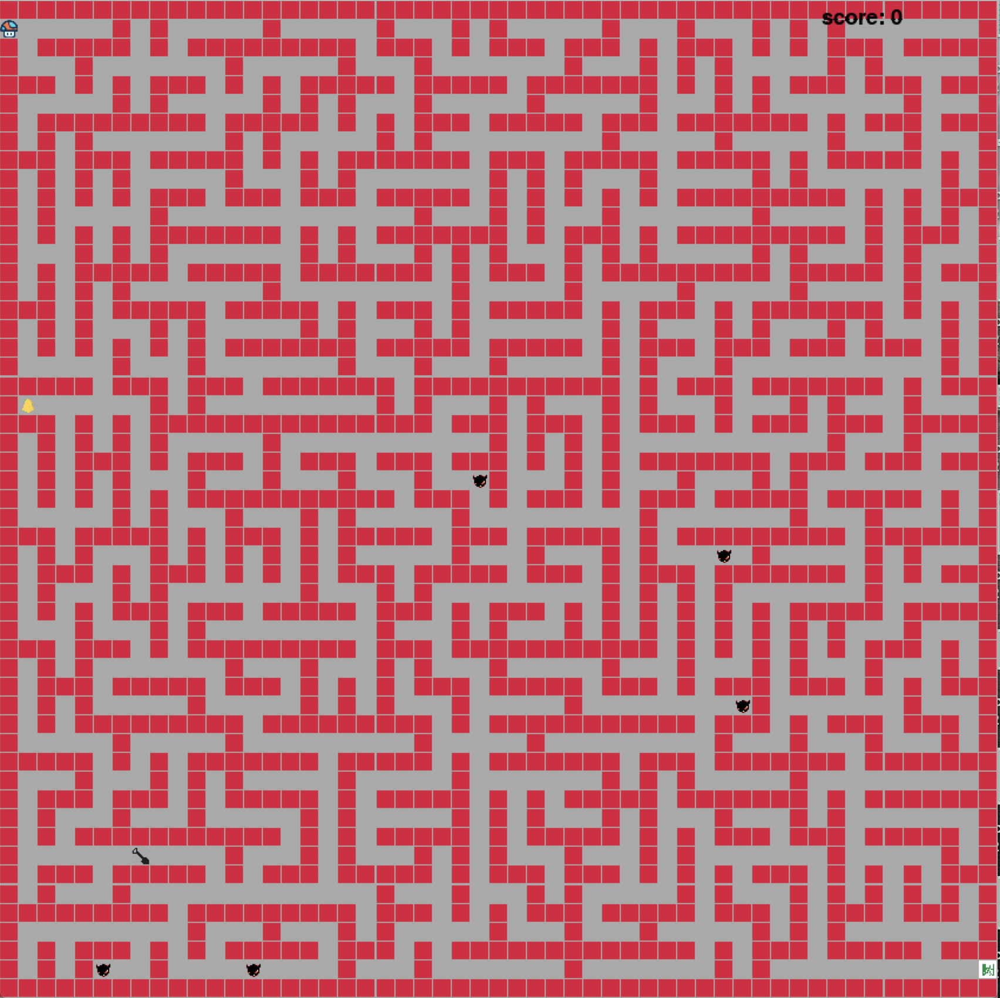

# **Amazing Maze**
- Working under dev branch
- The working game is in master branch

### Current Progress
- Moving the character
- Generating a random maze
- A randomly appear star
- Pick up the star!
  - Get a higher score
  - Destroy a random wall
- Added enemies
- 4 Difficulty levels
- Added a Start Menu

### **Game Play**
| You | Enemy | Treasure |
|:-----:|:-----:|:-----:|
||||
| In the game, you play a mushroom |They are fast and mushroom is their favorite food | A star have the ability to destroy a random wall |

### **Start Menu**

### **4 Difficulty levels**
| Easy | Medium | Hard | insane |
| -------- | -------- | -------- | -------- |
|  |  |  |  |
