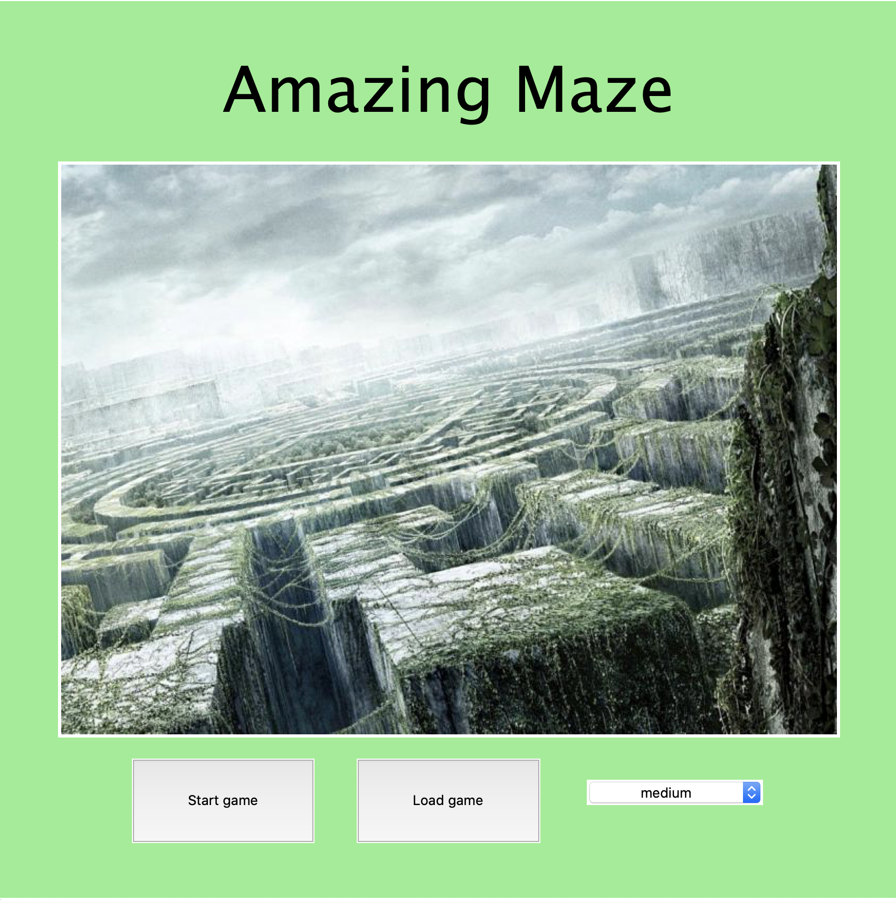
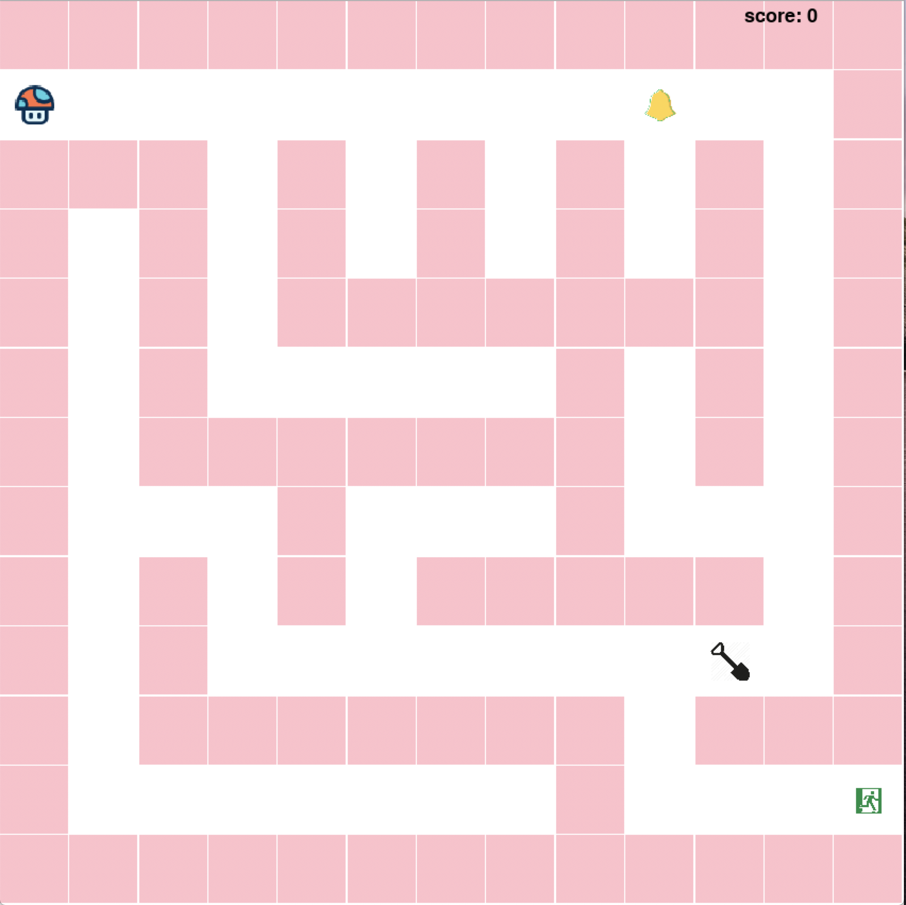

# **Amazing Maze**
### Run
- install Pygame  
    sh setup.sh
- Have fun  
    python3 start.py

### Current Progress
- Moving the character
- Generating a random maze
- A randomly appear star
- Pick up the star!
  - Get a higher score
  - Destroy a random wall
- Added enemies
- 4 Difficulty levels
- Added a Start Menu

### *Game Play*
| You | Enemy | Shovel | Hint Bell |
|:-----:|:-----:|:-----:| :-----: |
| | | |  |
| In the game, you play a mushroom |They are fast and mushroom is their favorite food | The shovel can destroy a surrounding wall | The Hint Bell will show you a possible path for 5 seconds |

### *Start Menu*

### *4 Difficulty levels*
| Easy | Medium | Hard | insane |
| -------- | -------- | -------- | -------- |
|  |  |  |  |

### *END*
| Win | Game Over|
| :---: | :---: |
|||
